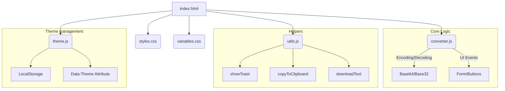
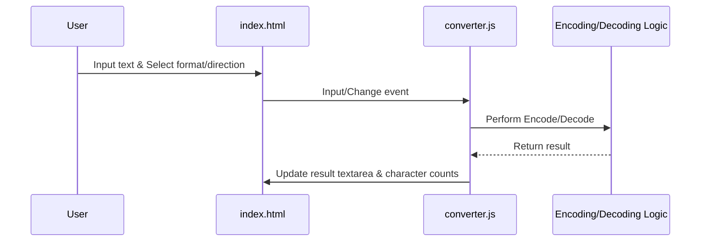

# enkoda — Base64 & Base32 Converter

A simple, fast, and accessible static website for encoding and decoding text using Base64 and Base32 formats.

[](https://enkoda.yogu.one)
[](LICENSE)

## Features

- **Base64 Conversion:** Encode and decode text with full UTF-8 support
- **Base32 Conversion:** Full RFC 4648 compliant Base32 support
- **Real-time Conversion:** Results update instantly as you type
- **Responsive Design:** Mobile-first approach, works beautifully on all devices
- **Dark Mode Support:** Automatically detects and respects system theme preference
- **Accessibility:** Screen reader friendly, keyboard navigable, ARIA labels
- **Privacy:** All conversions happen locally in your browser. No data is sent to any server
- **Utility Tools:**
  - Copy to clipboard with toast notifications
  - Download result as text file
  - Character counting for input and output
  - Swap input and output with direction toggle
  - Clear all fields
  - Error handling for invalid inputs

## Local Development

You can serve the project locally using Deno or simply by opening the `web/index.html` file in your browser. Using Deno is recommended for the best development experience.

### Prerequisites

- **Deno**: Required for the local development server and formatting tools.
- **Make**: (Optional) For using the automated tasks in the `Makefile`.

### Running the Server

Using the `Makefile` (requires Deno):

```bash
make serve
```

Alternatively, run the Deno script directly:

```bash
deno run --allow-net --allow-read serve.ts
```

The site will be available at `http://localhost:8000`.

### Development Commands

```bash
# Start development server
make serve

# Format JavaScript and CSS files
make format

# Lint JavaScript files
make lint
```

## Technologies Used

- **HTML5** - Semantic markup, native form validation
- **CSS3** - Custom Properties, Grid, Flexbox, responsive design
- **Vanilla JavaScript (ES6+)** - No frameworks, native DOM manipulation
- **Deno** - Local development server and tooling
- **Inter Font** - Modern, readable typeface

## Architecture

The project follows a **Modular Vanilla Web** pattern, using native browser features without any build step.

### Component Diagram



### Conversion Workflow



## Project Structure

```
enkoda/
├── web/
│   ├── index.html          # Main application entry point
│   ├── css/
│   │   ├── styles.css      # Core styles and layout
│   │   └── variables.css   # Theme variables (light/dark mode)
│   ├── js/
│   │   ├── converter.js    # Encoding/decoding logic
│   │   ├── utils.js        # Helper functions (copy, download, toast)
│   │   └── theme.js        # Theme toggle and persistence
│   └── assets/
│       └── enkoda.png      # Project logo
├── AGENTS.md               # AI Agent development guidelines
├── LICENSE                 # GNU GPL v3 Licence
├── Makefile                # Common development tasks
├── README.md               # This file
└── serve.ts                # Deno development server
```

## Browser Support

- Chrome/Edge (last 2 versions)
- Firefox (last 2 versions)
- Safari (last 2 versions)
- Mobile browsers (iOS Safari, Chrome Mobile)

## Accessibility Features

- Semantic HTML5 elements (`<main>`, `<section>`, `<form>`, `<label>`)
- Proper form labels associated with inputs
- ARIA attributes (`aria-label`, `aria-live`)
- Keyboard navigation support
- Visible focus indicators
- Screen reader friendly
- Sufficient colour contrast (WCAG AA minimum)
- Print-friendly styles

## Project History

This project's development started with a focus on a pure vanilla tech stack and accessibility. Key milestones in its evolution include:

- **v1.1 (2026-03-04):**
  - Enhanced UI with Swap, Clear, and Download buttons.
  - Improved theme management with `theme.js` to prevent FOUC.
  - Added dynamic labeling and character counts for better UX.
  - Standardised documentation and corrected licensing (GPL v3).
- **v1.0 (2026-03-03):**
  - Initial implementation with core Base64/Base32 conversion logic.
  - Established accessibility and performance targets.

## Licence

This project is licensed under the **GNU General Public License v3 (GPL-3.0)**. See the [LICENSE](LICENSE) file for details.
